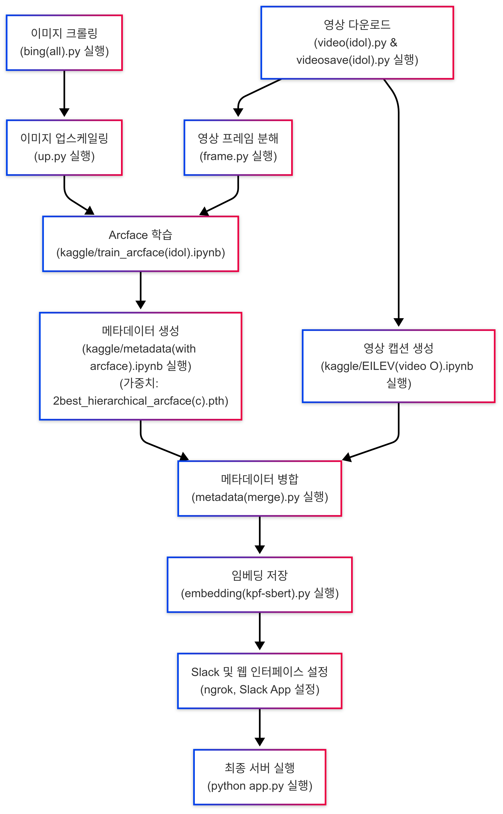
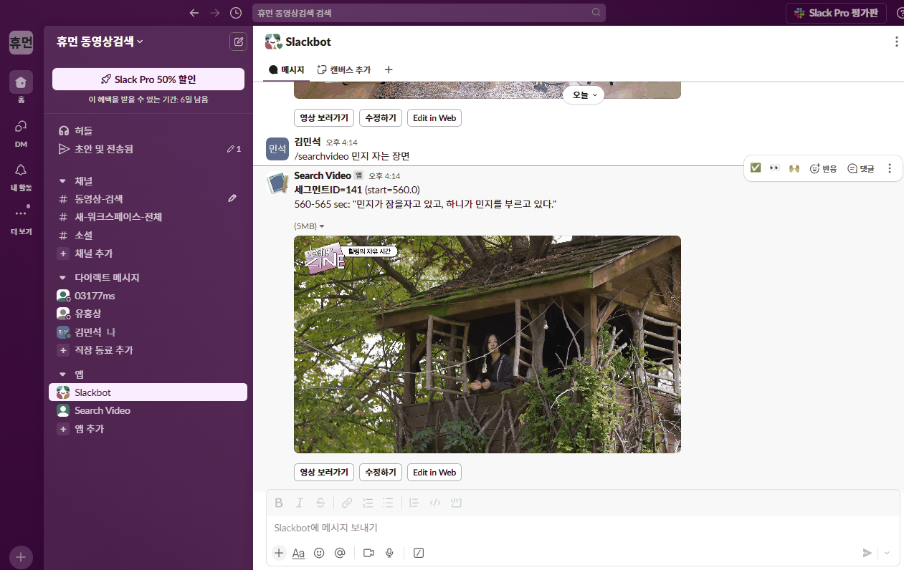
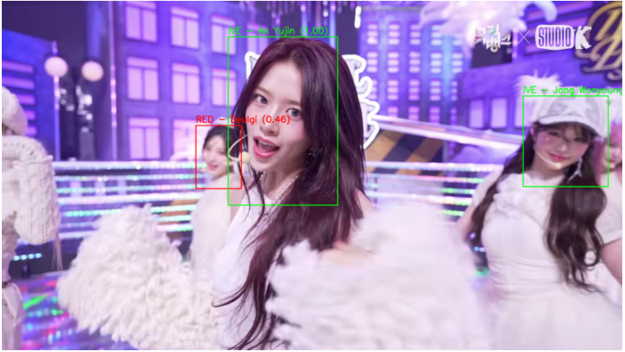
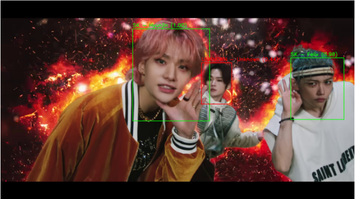

# Multimodal Video Search & Edit

본 프로젝트는 **영상**을 프레임 단위로 분석해, **Arcface** 모델을 기반하여 인물구별 학습을 진행한 가중치를 통한 인물 식별 메타데이터와 **BLIP2/EILEV** 모델을 통한 영상 캡션 메타데이터를 생성합니다. 이 두 메타데이터를 합쳐 **kpf-sbert** 기반 임베딩 DB에 저장하고, 이를 바탕으로 **검색 및 수정** 기능을 제공합니다. 또한, **Slack**과 연동하여 검색 결과를 공유하고, 특정 구간을 편집할 수 있도록 지원합니다.

> **Note:**  
> - **EILEV 모델**은 Git Submodule을 통해 [https://github.com/yukw777/EILEV.git](https://github.com/yukw777/EILEV.git) 에서 관리됩니다.  
> - **kpf-sbert-128d-v1** 모델은 [HuggingFace Model Hub](https://huggingface.co/bongsoo/kpf-sbert-128d-v1)에서 다운로드할 수 있습니다.

## 목차
1. [프로젝트 개요](#프로젝트-개요)
2. [설치 및 실행](#설치-및-실행)
3. [워크플로우](#워크플로우)
4. [실행 예시](#실행-예시)
5. [모델 성능 및 한계](#모델-성능-및-한계)
6. [TODO / Future Plans](#todo--future-plans)

---

## 프로젝트 개요

- **핵심 기능**  
  - **Arcface** 기반 인물 인식 (Buffalo 모델 사용) 및 인물구별 학습  
  - **BLIP2/EILEV** 모델로 영상 캡션 생성  
  - **kpf-sbert-128d-v1** 모델을 통한 한글/영어 임베딩 및 검색  
  - **Gemini LLM**(Google Generative AI)을 이용해 검색 결과를 한국어로 번역·요약  
  - **Slack 연동**을 통한 검색 결과 공유 및 편집 기능  
  - **수정 기능**: 특정 구간(세그먼트) 자막, 멤버 정보 업데이트 및 세그먼트의 생성, 병합, 분할 처리

---

## 설치 및 실행

### 필수 환경
- **Python:** 3.10.11  
- **PostgreSQL:** 15
- **ngrok:** [ngrok 다운로드](https://ngrok.com/)

### 설치 순서

1. **pip install -r requirments.txt**
2. **config.json 파일 생성해 {
    "YOUTUBE_API_KEY": "",
    "GEMINI_API_KEY": "",
    "SLACK_API_KEY": ""
}
이런식으로 키를 입력**
3. **embedding(kpf-sbert).py 를 실행해 메타데이터를 벡터에 저장**

## 워크플로우

아래 이미지는 프로젝트 전체 워크플로우를 시각화한 것입니다.

  

## 실행 예시

아래 GIF는 Slack에서 Slash Command를 이용해 검색을 수행하고, 간단한 수정 및 확인을 하는 과정을 보여줍니다.  
**Edit in Web** 버튼을 누르면 작업 페이지로 이동하여 캡션, 멤버, 세그먼트 등을 수정할 수 있습니다.

## 모델 성능 및 한계

- **Arcface 기반 모델**  
  - 인물 분류(F1) 스코어가 0.91 이상으로 측정되는 등 높은 정확도를 보이지만, 영상 화질이나 조명에 따라 인식률이 떨어질 수 있습니다.  
  - 그룹 구분 F1: 0.8928, mAP: 0.9188, ROC-AUC: 0.9879  
  - 멤버 구분 F1: 0.9149, mAP: 0.9570, ROC-AUC: 0.9854  
  - 학습 가중치(`2best_hierarchical_arcface(c).pth`) 사용
  

  
  

- **EILEV 모델 (BLIP2 기반)**  
  - 영상 캡션 생성은 영어 기준으로는 우수하지만, 한국어로 번역 시 문맥이 매끄럽지 않거나, “여자를 남자로 인식”하는 등 일부 오차가 존재합니다.  
  - Gemini LLM을 통해 보완하나, 상황에 따라 부자연스러운 번역/설명이 나올 수 있습니다.

---

## TODO / Future Plans

1. **객체 탐지 모델로 확장**  
   - 현재 Arcface Buffalo 모델을 기반으로 인물 인식에 특화되어 있음.  
   - **YOLO 모델**(백본 + 헤드 파인튜닝)을 도입해, **인물 외 사물/배경** 등 더 많은 객체를 탐지해 메타데이터를 풍부하게 만들 계획.

2. **다른 캡션 생성 모델 적용**  
   - EILEV(BLIP2) 외에 **mVideoT5**, **VideoCLIP** 등 다양한 영상 캡션 모델로 교체/비교 실험을 진행해, 캡션 품질과 한국어 번역 정확도를 높일 예정.
   - EILEV(BLIP2) 안에 체크포인트를 가져와 fine-tuning하여 bbox가 그려진 이미지를 인식, 디텍션한 객체에 대한 설명이 좀 더 매끄럽게 나오게 만들 계획.

3. **Revert(되돌리기) 기능 보강**  
   - 히스토리 테이블 기반으로, 과거 버전으로 롤백할 수 있는 기능 구현.

4. **UI & 번역 품질 개선**  
   - 한글 캡션이 매끄럽게 나오도록 LLM 프롬프트/번역 파이프라인 최적화.  
   - 웹 UI에서 검색 결과, 편집 과정을 더 직관적으로 표시.

